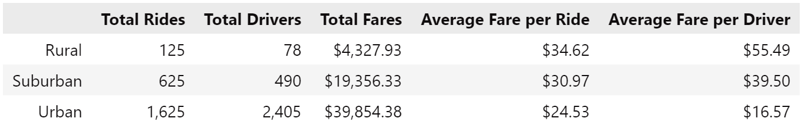

# PyBer Analysis

## Overview
The purpose of this analysis was to take 2 CSV files, with city data and ride data, merge them, and extract information about 
ride frequencies by week in different types of areas ('Urban', 'Suburban', and 'Rural'). The data shown was collected from January through April of 2019.

## Summary
The summary DataFrame is presented below.
