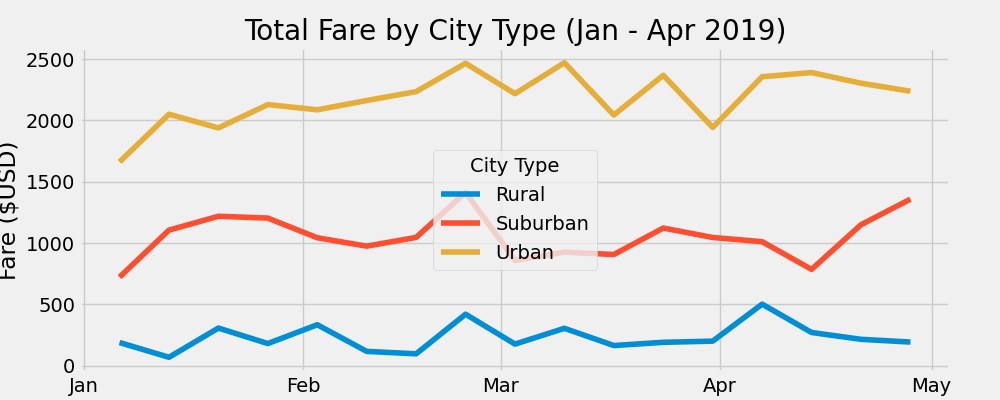

# PyBer Analysis

## Overview
The purpose of this analysis was to take 2 CSV files, with city data and ride data, merge them, and extract information about 
ride frequencies by week in different types of areas ('Urban', 'Suburban', and 'Rural'). The data shown was collected from January through April of 2019.

## Summary
The summary DataFrame is presented below.

From the table, its clear that urban rides comprise the vast majority of rides (68%), followed by suburban (26%) and then rural (6%). The proportion of drivers in urban areas is even higher (81%). Since rural rides are likely longer, the fare per ride is higher than in suburban or urban areas. This, along with less drivers, explains the high fare per driver in rural areas compared to urban and suburban ones.

The weekly plot of rides by city type is shown below.

